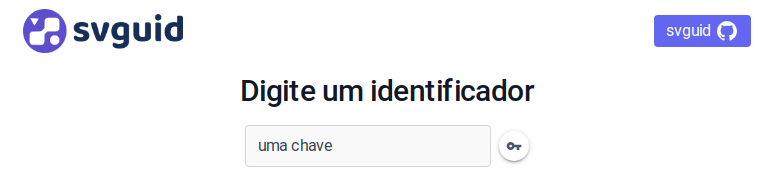

 
> Versão alpha beta gama ....
>

## Como rodar?

Clone ou faça o download deste repositório. Acesse a pasta, instale as dependências e execute-o com `npm run dev`  

```bash
git clone https://github.com/mmamorim/svguid.git
cd svguid
npm install
npm run dev
```

Abra o navegador e acesse a url: `http://localhost:5173/`


Cada identificador digitado irá gerar uma chave hash que poderá ser visualizada a partir do botão ao lado.




